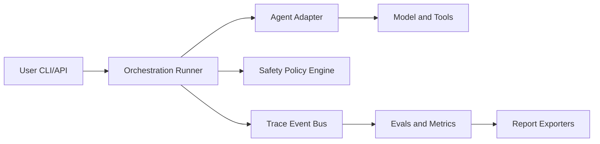

# OpenRe: AI Agent Evaluation, Benchmarking, Tracing, and Safety Workbench


[](https://github.com/reiidoda/OpenRe/actions/workflows/ci.yml)
[](https://github.com/reiidoda/OpenRe/actions/workflows/eval-regression.yml)
[](LICENSE)
[](pyproject.toml)

Open-source workbench for benchmarking, tracing, optimizing, and safely operating multimodal AI agents with human approval.

## Keywords
AI agents, agent evaluation, LLM evaluation, agent benchmarking, agent observability, AI safety, multimodal agents, prompt optimization, tool-use evaluation, trace-based debugging.

## Table of contents
- [Why this exists](#why-this-exists)
- [How OpenRe improves future AI systems](#how-openre-improves-future-ai-systems)
- [Supported tasks](#supported-tasks)
- [Architecture diagram](#architecture-diagram)
- [Quickstart](#quickstart)
- [Example commands](#example-commands)
- [Failure cases](#failure-cases)
- [Safety model](#safety-model)
- [Dataset format](#dataset-format)
- [Plugin/adapters](#pluginadapters)
- [Roadmap](#roadmap)
- [Enterprise docs](#enterprise-docs)
- [Contributing](#contributing)

| Snapshot | Value |
| --- | --- |
| Dataset | `research_assistant_v1` |
| Configs compared | `research_basic`, `research_multimodal` |
| Success rate | `TBD` |
| Avg quality score | `TBD` |
| Cost / successful task | `TBD` |

## Why this exists

Most agent repos show demos, not engineering systems. OpenRe is benchmark-first, trace-first, and safety-first so behavior changes are measurable and auditable.

## How OpenRe improves future AI systems

OpenRe is designed to improve how AI systems are developed and deployed:
- detect regressions early when models, prompts, or tools change
- enforce safer execution with policy and approval gates
- collect structured traces and benchmarks to reveal what works
- make improvements repeatable through eval-driven iteration

OpenRe improves engineering quality, reliability, and trust in AI products. It does not directly create a new base model architecture.

## Supported tasks

- Text research over local files and web search.
- Multimodal research with image-aware task inputs.
- Browser/computer-use tasks behind explicit safety gates.

## Architecture diagram



Additional system/domain/OO flow graphs are available in [docs/03_system_context.md](docs/03_system_context.md), [docs/04_container_architecture.md](docs/04_container_architecture.md), [docs/06_domain_model.md](docs/06_domain_model.md), and [docs/07_oo_design.md](docs/07_oo_design.md).

## Quickstart

```bash
git clone <repo-url>
cd OpenRe
python3 -m venv .venv
source .venv/bin/activate
pip install -e '.[dev]'
awb run --dataset datasets/research_assistant_v1 --config configs/agents/research_basic.yaml
```

## Example commands

```bash
awb run --dataset datasets/research_assistant_v1 --config configs/agents/research_basic.yaml
awb compare --dataset datasets/research_assistant_v1 --configs configs/agents/research_basic.yaml configs/agents/research_multimodal.yaml
awb eval --run-id run_001
awb optimize --dataset datasets/research_assistant_v1 --search-space configs/agents/research_basic.yaml
awb approve --request-id apr_001 --decision approve
awb report --run-id run_001 --format html
```

## Failure cases

- Tool timeout or malformed tool result.
- Prompt-injected source causing policy rejection.
- High-risk action denied by approver.
- Run budget exhausted before completion.

## Safety model

- Risk levels: `LOW`, `MEDIUM`, `HIGH`, `CRITICAL`.
- Default deny for destructive actions.
- Domain allowlists for browser/computer tools.
- Mandatory approval for `HIGH` and `CRITICAL` actions.
- Immutable audit logs for approvals and denials.

## Dataset format

Each task includes task id, instruction, expected output fields, grading rubric refs, risk label, tags, and metadata.

## Plugin/adapters

- OpenAI adapters (Responses, Agents SDK, tracing, computer-use).
- Optional Opik sinks (trace/eval/optimizer).
- Storage adapters (SQLite + filesystem).

## Roadmap

See [ROADMAP.md](ROADMAP.md) and [MILESTONES.md](MILESTONES.md).

## Enterprise docs

Enterprise-level architecture and engineering documentation is indexed in [docs/28_enterprise_reference_map.md](docs/28_enterprise_reference_map.md).

SEO and discoverability strategy is documented in [docs/29_seo_and_discoverability.md](docs/29_seo_and_discoverability.md).

## Contributing

See [CONTRIBUTING.md](CONTRIBUTING.md) and [CODE_OF_CONDUCT.md](CODE_OF_CONDUCT.md).
