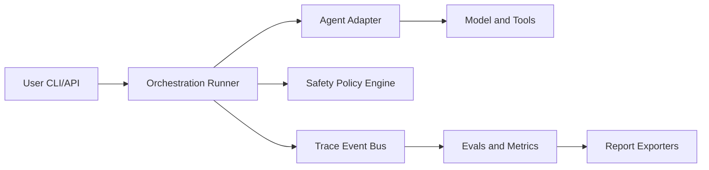

# OpenRe


Open-source workbench for benchmarking, tracing, optimizing, and safely operating multimodal agents with human approval.

| Snapshot | Value |
| --- | --- |
| Dataset | `research_assistant_v1` |
| Configs compared | `research_basic`, `research_multimodal` |
| Success rate | `TBD` |
| Avg quality score | `TBD` |
| Cost / successful task | `TBD` |

## Why this exists

Most agent repos show demos, not engineering systems. This repo is benchmark-first, trace-first, and safety-first so changes can be measured and audited.

OpenRe is designed to improve how AI systems are developed and deployed: detect regressions early, enforce safer execution, and make improvements repeatable with evidence.

## Supported tasks

- Text research over local files and web search.
- Multimodal research with image-aware task inputs.
- Browser/computer-use tasks behind explicit safety gates.

## Architecture diagram



Additional system/domain/OO flow graphs are available in [docs/03_system_context.md](docs/03_system_context.md), [docs/04_container_architecture.md](docs/04_container_architecture.md), [docs/06_domain_model.md](docs/06_domain_model.md), and [docs/07_oo_design.md](docs/07_oo_design.md).

Enterprise-level design documentation is available in [docs/28_enterprise_reference_map.md](docs/28_enterprise_reference_map.md), including HLD, LLD, database strategy, API/security, distributed architecture, performance, UML, and AI/ML roadmap views.

## Quickstart

```bash
git clone <repo-url>
cd open-agent-workbench
python -m venv .venv
source .venv/bin/activate
pip install -e .[dev]
awb run --dataset datasets/research_assistant_v1 --config configs/agents/research_basic.yaml
```

## Example commands

```bash
awb run --dataset datasets/research_assistant_v1 --config configs/agents/research_basic.yaml
awb compare --dataset datasets/research_assistant_v1 --configs configs/agents/research_basic.yaml configs/agents/research_multimodal.yaml
awb eval --run-id run_001
awb optimize --dataset datasets/research_assistant_v1 --search-space configs/agents/research_basic.yaml
awb approve --request-id apr_001 --decision approve
awb report --run-id run_001 --format html
```

## Failure cases

- Tool timeout or malformed tool result.
- Prompt-injected source causing policy rejection.
- High-risk action denied by approver.
- Run budget exhausted before completion.

## Safety model

- Risk levels: `LOW`, `MEDIUM`, `HIGH`, `CRITICAL`.
- Default deny for destructive actions.
- Domain allowlists for browser/computer tools.
- Mandatory approval for `HIGH` and `CRITICAL` actions.
- Immutable audit logs for approvals and denials.

## Dataset format

Each task includes task id, instruction, expected output fields, grading rubric refs, risk label, tags, and metadata.

## Plugin/adapters

- OpenAI adapters (Responses, Agents SDK, tracing, computer-use).
- Optional Opik sinks (trace/eval/optimizer).
- Storage adapters (SQLite + filesystem).

## Roadmap

See [ROADMAP.md](ROADMAP.md) and [MILESTONES.md](MILESTONES.md).

## Contributing

See [CONTRIBUTING.md](CONTRIBUTING.md) and [CODE_OF_CONDUCT.md](CODE_OF_CONDUCT.md).
