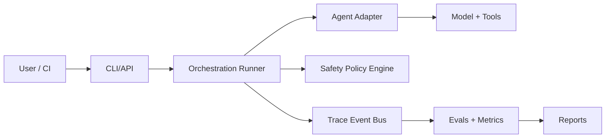

# OpenRe: Open-Source AI Agent Evaluation and Safety Workbench


[](https://github.com/reiidoda/OpenRe/actions/workflows/ci.yml)
[](https://github.com/reiidoda/OpenRe/actions/workflows/docs-quality.yml)
[](https://github.com/reiidoda/OpenRe/actions/workflows/eval-regression.yml)
[](LICENSE)
[](pyproject.toml)
[](https://github.com/reiidoda/OpenRe/stargazers)

OpenRe is a benchmark-first, trace-first, and safety-first platform for building reliable AI agent systems.

It helps teams benchmark agent configurations, run repeatable evaluations, inspect trace-level behavior, enforce approval gates, and optimize quality/cost/latency with evidence.

## Why this project matters

Most AI-agent projects are demo-driven. OpenRe is engineering-driven:
- measurable behavior through dataset-based benchmarks
- testable changes through eval and regression workflows
- auditable execution through structured traces and immutable logs
- safer operations through policy and human approval gates

OpenRe improves how AI is built and deployed. It is not a base-model breakthrough project.

## Keywords

AI agents, agent evaluation, LLM evaluation, agent benchmarking, agent observability, AI safety, multimodal agents, trace analysis, prompt optimization, tool-use testing, regression testing for agents.

## What you can do with OpenRe

- Compare two or more agent configs on the same task set.
- Capture structured traces for every run and tool step.
- Grade output quality and trace quality.
- Block risky actions until explicit approval.
- Export benchmark artifacts as JSON, CSV, and HTML.

## Architecture overview



Deep architecture docs: [Documentation Hub](docs/README.md)

## Quickstart

```bash
git clone <repo-url>
cd OpenRe
python3 -m venv .venv
source .venv/bin/activate
pip install -e '.[dev]'
awb run --dataset datasets/research_assistant_v1 --config configs/agents/research_basic.yaml
```

## Example commands

```bash
awb run --dataset datasets/research_assistant_v1 --config configs/agents/research_basic.yaml
awb compare --dataset datasets/research_assistant_v1 --configs configs/agents/research_basic.yaml configs/agents/research_multimodal.yaml
awb eval --run-id run_001
awb optimize --dataset datasets/research_assistant_v1 --search-space configs/agents/research_basic.yaml
awb approve --request-id apr_001 --decision approve
awb report --run-id run_001 --format html
```

## Contribute now

We are actively building core features. Contributions are welcome across engineering, eval design, safety, docs, and architecture.

- Good first issues: [good first issue](https://github.com/reiidoda/OpenRe/issues?q=is%3Aopen+is%3Aissue+label%3A%22good+first+issue%22)
- Help wanted: [help wanted](https://github.com/reiidoda/OpenRe/issues?q=is%3Aopen+is%3Aissue+label%3A%22help+wanted%22)
- Milestone backlog: [milestones](https://github.com/reiidoda/OpenRe/milestones)
- Contributor guide: [CONTRIBUTING.md](CONTRIBUTING.md)

### Contribution lanes

- Agent adapters and tool contracts
- Dataset and rubric design
- Evaluation and regression logic
- Safety policy and approval workflows
- Reporting, DX, and docs quality

## Roadmap and milestones

- Roadmap: [ROADMAP.md](ROADMAP.md)
- Milestones: [MILESTONES.md](MILESTONES.md)
- Project workflow: [PROJECTS.md](PROJECTS.md)

## Documentation

- Vision and PRD: [docs/01_vision_and_scope.md](docs/01_vision_and_scope.md), [docs/02_prd.md](docs/02_prd.md)
- Architecture and design: [docs/20_architecture_and_project_structure.md](docs/20_architecture_and_project_structure.md)
- Database and distributed systems: [docs/21_database_strategy_and_distributed_data_design.md](docs/21_database_strategy_and_distributed_data_design.md)
- API/security: [docs/22_api_design_and_security.md](docs/22_api_design_and_security.md)
- Scalability/performance: [docs/23_scalability_performance_cost_and_event_driven_architecture.md](docs/23_scalability_performance_cost_and_event_driven_architecture.md)
- Testing/quality/SCM: [docs/24_testing_quality_metrics_and_scm.md](docs/24_testing_quality_metrics_and_scm.md)
- AI/ML strategy: [docs/27_ai_ml_dl_nlp_neuroscience_data_science.md](docs/27_ai_ml_dl_nlp_neuroscience_data_science.md)
- SEO/discoverability: [docs/29_seo_and_discoverability.md](docs/29_seo_and_discoverability.md)

## FAQ

### Is OpenRe an AI model?
No. OpenRe is an engineering workbench to evaluate and govern AI agent systems.

### Does OpenRe support safety approvals?
Yes. Policy and approval flows are first-class architecture components.

### Can OpenRe help reduce regressions?
Yes. It is built around evals, benchmark comparisons, and regression gates.

## Community standards

- Code of Conduct: [CODE_OF_CONDUCT.md](CODE_OF_CONDUCT.md)
- Security policy: [SECURITY.md](SECURITY.md)
- Governance: [GOVERNANCE.md](GOVERNANCE.md)
