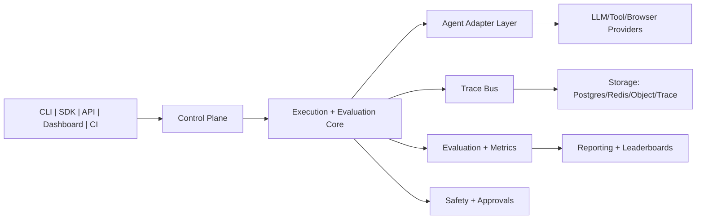

# OpenRe: The Default Framework for Testing AI Agents


[](https://github.com/reiidoda/OpenRe/actions/workflows/ci.yml)
[](https://github.com/reiidoda/OpenRe/actions/workflows/docs-quality.yml)
[](https://github.com/reiidoda/OpenRe/actions/workflows/eval-regression.yml)
[](LICENSE)
[](pyproject.toml)
[](https://github.com/reiidoda/OpenRe/stargazers)

OpenRe is a benchmark-first, trace-first, safety-first framework for testing, evaluating, debugging, and validating AI agents.

## Positioning

OpenRe is to AI agents what `pytest` is to Python testing:
- define repeatable agent tests
- run them locally or in CI
- inspect traces and failures
- compare configurations across versions
- enforce safety gates for risky actions

OpenRe improves how AI systems are engineered and deployed. It is not a base-model invention project.

## Core value

OpenRe helps teams answer, with evidence:
- does the agent still work after model/prompt/tool changes?
- what failed, where, and why?
- which config is best for quality, cost, latency, and safety?
- can risky actions be blocked or approval-gated?
- can runs be reproduced, audited, and compared over time?

## Product surfaces

OpenRe roadmap targets these interfaces as first-class surfaces:
- CLI (`openre` and `awb` aliases)
- Python SDK
- REST API and optional gRPC contract
- Web dashboard (trace viewer, approval queue, leaderboard)
- CI/CD integration
- plugin system for adapters/evaluators/exporters

## Core commands

```bash
openre init
openre test --benchmark benchmarks/research.yaml --config configs/agents/research_basic.yaml
openre run --dataset datasets/research_assistant_v1 --config configs/agents/research_basic.yaml
openre compare --dataset datasets/research_assistant_v1 --configs configs/agents/research_basic.yaml configs/agents/research_multimodal.yaml
openre trace run_123
openre eval --run-id run_123
openre approve --request-id apr_123 --decision approve
openre report --run-id run_123 --format html
openre leaderboard
```

## Architecture snapshot



## Quickstart

```bash
git clone https://github.com/reiidoda/OpenRe.git
cd OpenRe
python3 -m venv .venv
source .venv/bin/activate
pip install -e '.[dev]'
openre run --dataset datasets/research_assistant_v1 --config configs/agents/research_basic.yaml
```

Notes:
- `openre` is the canonical command name.
- `awb` remains available as a compatibility alias.

## Five benchmark packs (target)

- Pack A: Research Agent Benchmark
- Pack B: Tool Use Benchmark
- Pack C: Browser Agent Benchmark
- Pack D: Multimodal Benchmark
- Pack E: Enterprise Workflow Benchmark

## Safety model

Risk classes:
- low
- medium
- high
- critical

Typical approval-required actions:
- browser form submission
- external API writes
- shell execution
- filesystem delete
- financial or production-impact operations

## Documentation

Start here: [docs/README.md](docs/README.md)

Canonical product spec: [docs/32_openre_default_framework_spec.md](docs/32_openre_default_framework_spec.md)

Recommended core docs:
- Vision and scope: [docs/01_vision_and_scope.md](docs/01_vision_and_scope.md)
- High-level design: [docs/18_high_level_design.md](docs/18_high_level_design.md)
- Low-level design: [docs/19_low_level_design.md](docs/19_low_level_design.md)
- Architecture/project structure: [docs/20_architecture_and_project_structure.md](docs/20_architecture_and_project_structure.md)
- Roadmap: [ROADMAP.md](ROADMAP.md)
- Milestones: [MILESTONES.md](MILESTONES.md)

## Contribution lanes

- Adapter ecosystem (OpenAI/LangChain/CrewAI/AutoGen/custom)
- Evaluators and benchmark packs
- Safety and policy engine
- Orchestration and distributed execution
- Reports/dashboard/UX
- Docs/examples/CI templates

See [CONTRIBUTING.md](CONTRIBUTING.md), [PROJECTS.md](PROJECTS.md), and [MILESTONES.md](MILESTONES.md).

## Community and governance

- Code of Conduct: [CODE_OF_CONDUCT.md](CODE_OF_CONDUCT.md)
- Security policy: [SECURITY.md](SECURITY.md)
- Governance: [GOVERNANCE.md](GOVERNANCE.md)
