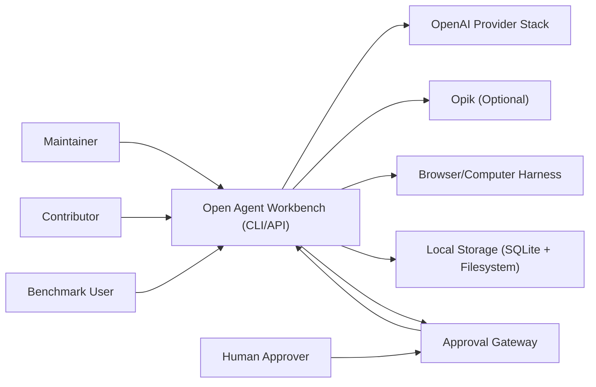

# System Context

## Actors
- Maintainer
- Contributor
- Benchmark user
- Human approver

## External systems
- OpenAI model/tool stack
- Optional Opik observability stack
- Browser/computer harness
- Local artifact storage

## System boundary
Open Agent Workbench orchestrates tasks, tools, policies, traces, evals, and reports.

## Context graph

