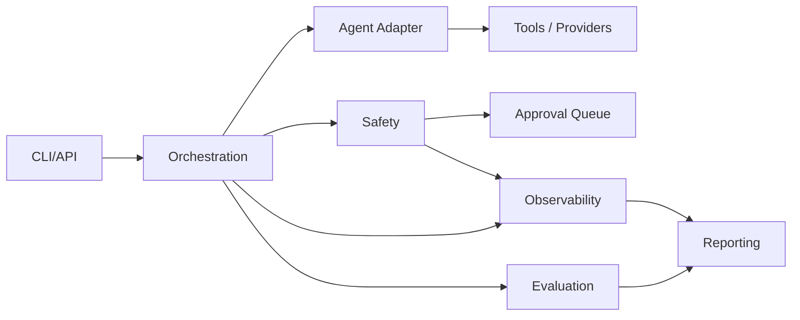
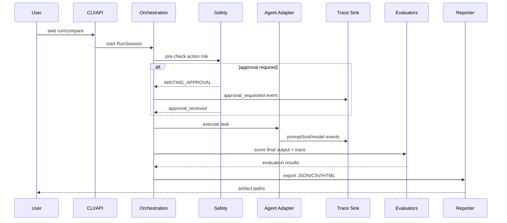

# Container Architecture

## Containers
- CLI/API: command and control entrypoint
- Orchestration: run lifecycle coordination
- Evaluation: grading and metrics
- Safety: policy checks and approval queue
- Observability: trace and event sinks
- Reporting: JSON/CSV/HTML exports

## Data flow
`CLI/API -> Orchestration -> Agent/Tools -> Trace -> Evals -> Reports`

## Container interaction graph

## Run sequence graph

