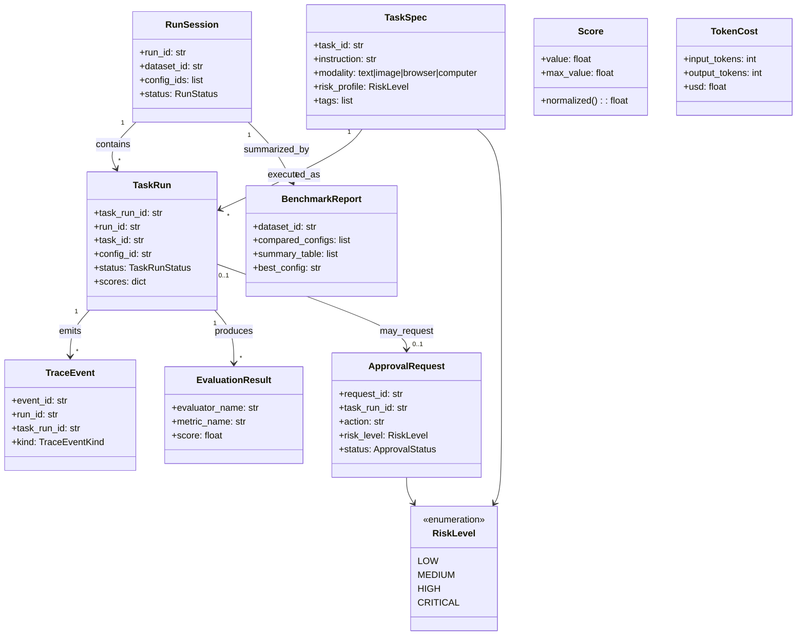

# Domain Model

## Entities
- `TaskSpec`
- `RunSession`
- `TaskRun`
- `TraceEvent`
- `EvaluationResult`
- `ApprovalRequest`
- `BenchmarkReport`

## Value objects
- `Score`
- `RiskLevel`
- `TokenCost`

## Entity graph

