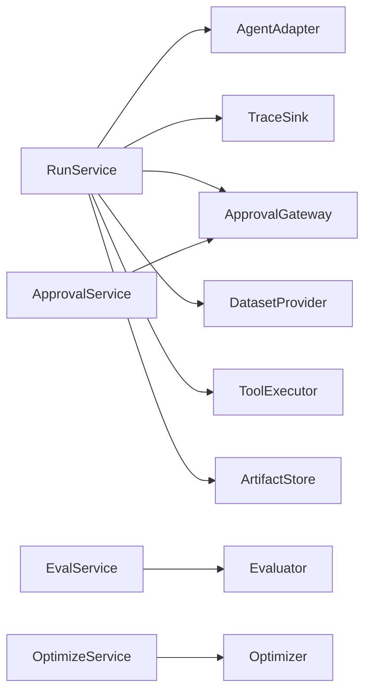
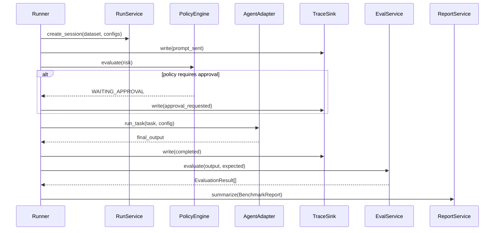

# Object-Oriented Design

## Key interfaces
- `AgentAdapter`
- `ToolExecutor`
- `TraceSink`
- `Evaluator`
- `Optimizer`
- `ApprovalGateway`
- `DatasetProvider`

## Collaboration
`RunService` orchestrates entities via interfaces and concrete adapters.

## Interface map

## Runtime collaboration sequence

