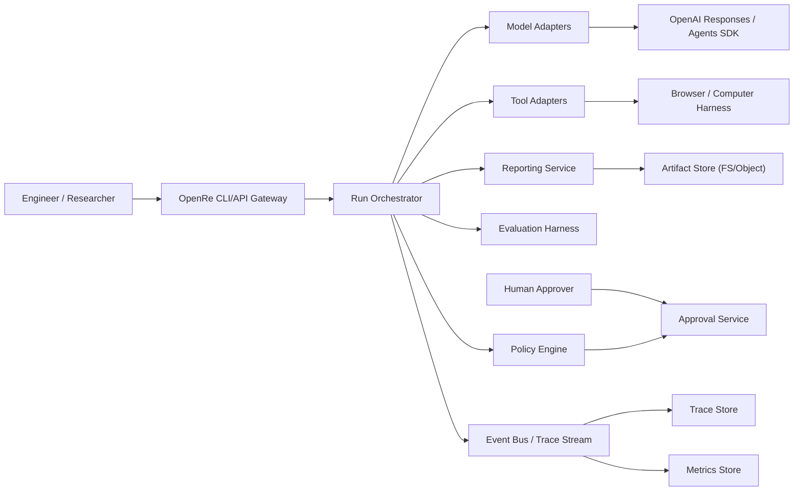

# High-Level Design

## Purpose
Define the enterprise blueprint for OpenRe as a benchmark-first, safety-first, and trace-first platform.

## System goals
- Compare multiple agent configurations on identical tasks.
- Preserve full observability and audit trails.
- Enforce approval and policy gates for risky actions.
- Scale from local single-node development to distributed execution.

## Functional boundaries
- Benchmark orchestration and run lifecycle management.
- Adapter-based model/tool execution.
- Evaluation and regression gating.
- Reporting and artifact exports.
- Governance, safety, and approvals.

## Quality attributes (NFRs)
- Reliability: deterministic retry + failure classification.
- Scalability: horizontal run workers and decoupled event transport.
- Security: zero-trust API boundaries, scoped access tokens, audit logs.
- Maintainability: hexagonal boundaries and test contracts.
- Observability: every run emits structured events with causality fields.

## System context diagram

## Enterprise operating model
- Control plane: orchestration, config, policies, approval routing.
- Data plane: task execution, tool invocation, model responses.
- Insight plane: traces, metrics, eval scores, benchmark dashboards.

## Source-informed principles
- Reliability/scalability/maintainability triad (DDIA).
- Architecture fitness and coupling tradeoffs (Fundamentals of Software Architecture).
- API-first consistency and secure defaults (API Design Patterns, API Security in Action).
