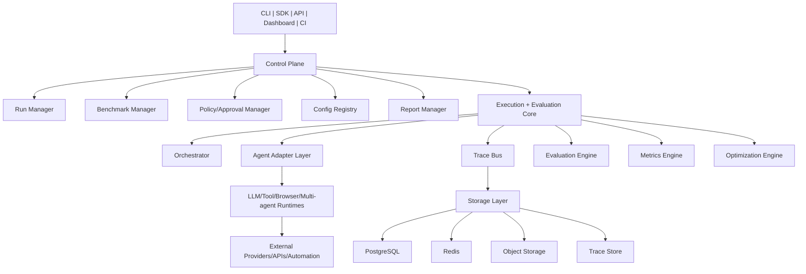

# High-Level Design

## Purpose
Define the target architecture for OpenRe as the default framework for testing AI agents.

## System goals
- Execute repeatable benchmark suites across multiple agent configurations.
- Capture complete trace evidence for every run.
- Evaluate outcomes with deterministic + semantic + safety-oriented graders.
- Enforce risk-aware safety gates and approval workflows.
- Produce machine-readable and human-readable benchmark artifacts.

## Product interfaces
- CLI
- Python SDK
- REST API
- optional gRPC contract
- Web dashboard
- CI integrations
- plugin system

## High-level architecture

## Operating planes
- Control plane: orchestration, policies, approvals, report lifecycle.
- Data plane: task execution, adapter invocation, tool actions.
- Insight plane: traces, metrics, evaluations, leaderboards.

## Quality attributes
- Reproducibility: config fingerprints + git SHA + evaluator versioning.
- Reliability: idempotent writes, retry policy, failure isolation.
- Scalability: local, single-node, distributed workers.
- Security: RBAC, approvals, audit logs, sandboxing.
- Extensibility: plugin-based adapters/evaluators/exporters.
- Observability: event stream with correlation metadata.

## Architectural style
- Hexagonal boundaries for domain isolation.
- Event-driven internals for traceability and replay.
- CQRS-lite split: command-oriented run/approval writes + query-oriented report/trace reads.

## Deployment modes
- Local developer mode.
- Team server mode.
- Cloud/distributed mode.

See [32_openre_default_framework_spec.md](32_openre_default_framework_spec.md) for complete product-level detail.
