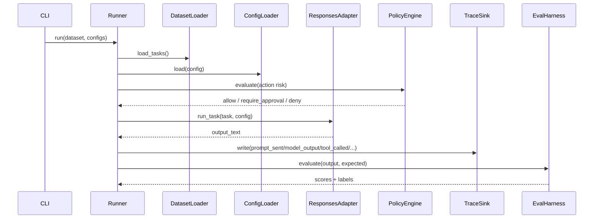
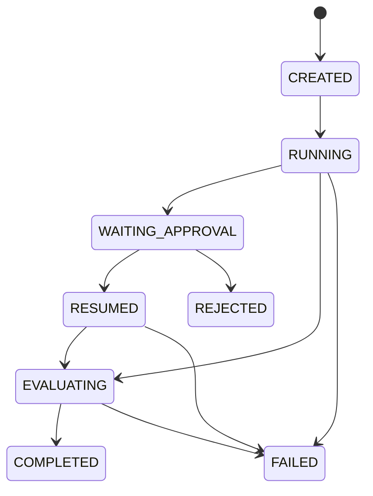

# Low-Level Design

## Runtime decomposition
- `Runner`: coordinates dataset/config execution.
- `DatasetLoader` and `ConfigLoader`: strict schema validation.
- `ResponsesAdapter`: model invocation contract.
- `JsonTraceSink`: append-only NDJSON event persistence.
- `EvalHarness`: output and trace scoring.

## Core request flow

## TaskRun state model

## Validation contracts
- Dataset rows must include: `task_id`, `instruction`, `modality`, `risk_label`.
- Agent config must include provider/model/tools/budgets and valid numeric bounds.
- Adapter must fail with actionable messages (path + field + reason).

## Error handling strategy
- User errors: deterministic validation exceptions with source context.
- Integration errors: retriable wrappers for transient network/tool failures.
- Safety errors: explicit deny responses, never silent fallthrough.

## Internal extension points
- `AgentAdapter` protocol for provider substitution.
- `Evaluator` strategy for score composition.
- `TraceSink` observer for local/cloud observability backends.
