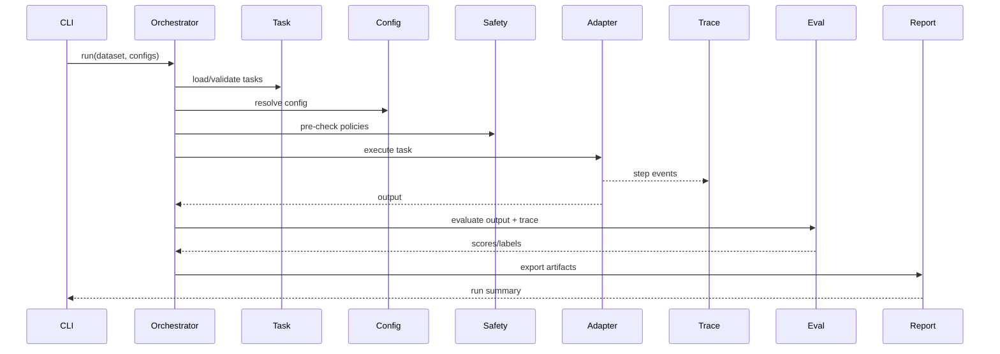
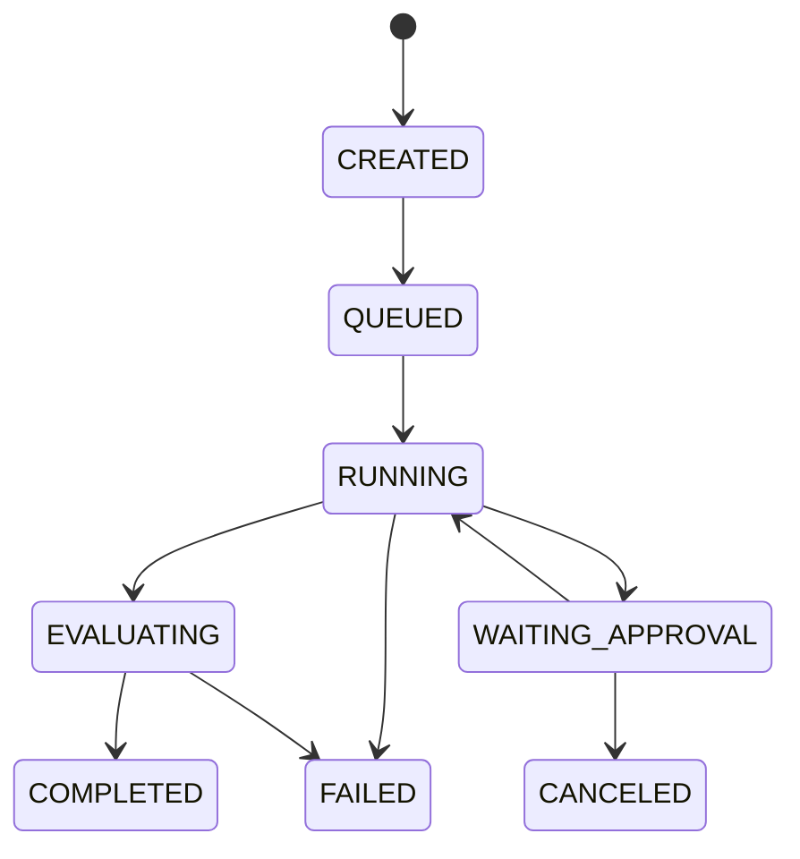
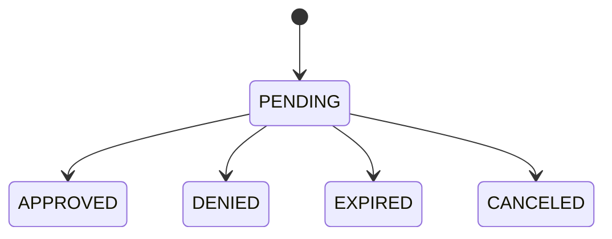

# Low-Level Design

## Purpose
Define implementation-level components, contracts, and state models for OpenRe runtime execution.

## Runtime decomposition
- `TaskService`: parse/validate/resolve task specs and datasets.
- `AgentConfigService`: register/fingerprint/diff agent configs.
- `OrchestrationService` (`Runner`): coordinates run lifecycle.
- `SafetyService`: risk assessment, policy decisions, approval requests.
- `EvaluationService`: evaluator pipelines and aggregation.
- `ReportService`: summary build + JSON/CSV/HTML export.
- `TraceBus`: append-only event capture and sink dispatch.

## Core entities
- `TaskSpec`
- `AgentConfig`
- `RunSession`
- `TaskRun`
- `TraceEvent`
- `EvaluationResult`
- `ApprovalRequest`
- `BenchmarkReport`

## Repository interfaces
- `TaskRepository`
- `RunRepository`
- `TraceRepository`
- `EvalRepository`
- `ApprovalRepository`
- `ReportRepository`

Pattern guidance:
- Repository + Unit of Work

## Adapter contract

Standard adapter API:
- `initialize(config)`
- `run(task_context)`
- `stream_events()`
- `get_result()`
- `cancel()`
- `cleanup()`

## Execution flow (sequence)

## State machines

### Run state

### Approval state

## Event schema baseline
Every event must include:
- `event_id`
- `run_id`
- `task_run_id`
- `event_type`
- `timestamp`
- `step_index`
- `correlation_id`
- `payload_json`

## Error handling policy
- Validation errors: deterministic with actionable field/path context.
- Adapter/integration errors: retry according to policy; classify terminal vs transient.
- Safety denials: explicit status and rationale, never silent continuation.

## Implementation note
See [32_openre_default_framework_spec.md](32_openre_default_framework_spec.md) for full formulas, scoring model, and subsystem coverage.
