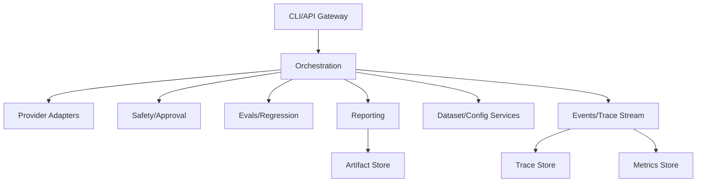

# Architecture and Project Structure

## Architecture style
- Hexagonal architecture for domain isolation.
- Config-driven runtime for reproducibility.
- Event-oriented telemetry for observability and replay.

## Container-level view



## Repository structure map

```text
src/agent_workbench/
  app/                 # CLI/API entrypoints and runtime settings
  domain/              # entities, value objects, interfaces, core services
  orchestration/       # runner, scheduling, lifecycle state machine
  adapters/            # OpenAI/Opik/local/storage integrations
  tools/               # local/web/browser/computer tool contracts
  evals/               # graders, metrics, regression policy
  optimizer/           # config and prompt search strategies
  safety/              # risk classification, approval, audit
  reporting/           # JSON/CSV/HTML benchmark outputs
  utils/               # ID, clock, serialization, hashing utilities
```

## Module ownership recommendations
- Domain: strict backward compatibility expectations.
- Adapters: provider-specific churn isolated behind interfaces.
- Evals/safety: policy-critical reviews + mandatory regression tests.
- Docs/configs: versioned alongside code changes.

## Architecture governance
- Architectural changes require ADR updates.
- Performance/security-sensitive changes require benchmark + risk impact section in PR.
