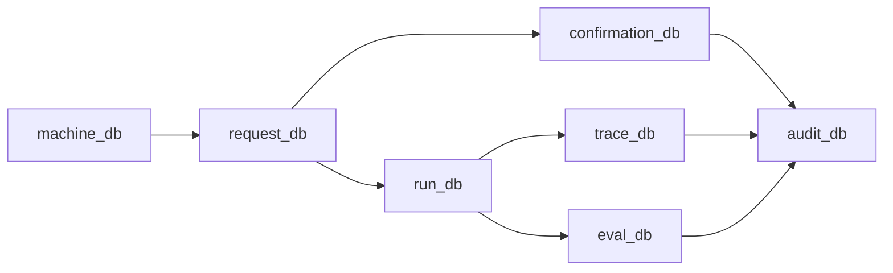

# Database Strategy and Distributed Data Design

## Database strategy
Use domain-owned data stores with explicit contracts between domains.

## Domain database topology
- `machine_db`: machine inventory, capabilities, state.
- `request_db`: incoming requests and lifecycle status.
- `confirmation_db`: approvals, denials, approver metadata.
- `run_db`: benchmark run/session metadata.
- `trace_db`: high-volume NDJSON/event records.
- `eval_db`: scores, labels, regressions.
- `audit_db`: immutable policy and security events.

## Inter-database dependency model

## Consistency strategy
- Strong consistency: approvals, billing, security policy decisions.
- Eventual consistency: analytics, derived reports, non-critical read models.
- Monotonic reads for operator-facing dashboards.

## Cross-database transaction strategy
- Avoid synchronous 2PC across domains.
- Use outbox pattern + idempotent consumers.
- Use saga orchestration for multi-step workflows.

## Data contracts
- Every event has `event_id`, `correlation_id`, `causation_id`, `timestamp`.
- Every domain record has immutable `created_at`, mutable `updated_at`, and `version` for optimistic concurrency.

## Storage technology guidance
- Operational metadata: PostgreSQL/Cloud SQL.
- High-volume traces: columnar/log store (ClickHouse/OpenSearch/BigQuery).
- Cache/state acceleration: Redis.
- Artifacts: object store with lifecycle policies.

## Backup and retention
- PITR for operational DBs.
- Immutable archive for audit and approval data.
- Tiered retention by data class (hot/warm/cold).

## Source-informed rationale
- Domain boundaries and data ownership (Building Microservices).
- Distributed consistency tradeoffs and event streams (DDIA).
