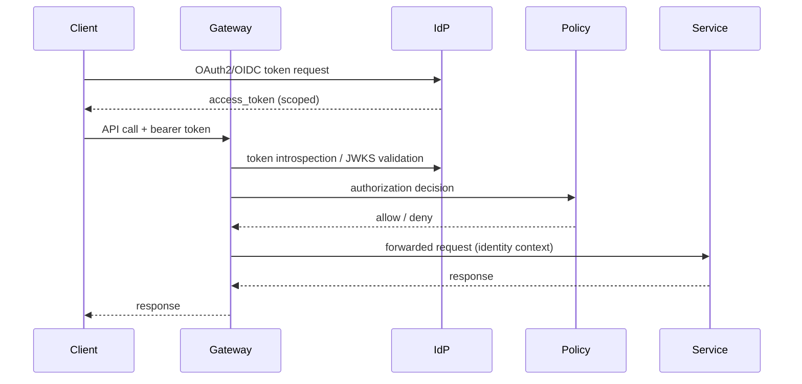

# API Design and Security

## API design style
- Resource-oriented REST for control-plane operations.
- Event and stream APIs for telemetry and asynchronous workflows.
- WebSocket channels for live run/trace updates.

## API versioning and compatibility
- URI or header-based versioning (`/v1`).
- Backward-compatible additive changes by default.
- Explicit deprecation windows + migration guides.

## Security baseline
- OAuth2/OIDC for user and service identity.
- Short-lived JWT access tokens with audience scoping.
- mTLS for service-to-service paths.
- HMAC request signing for high-integrity callbacks.
- WAF + rate limiting + abuse detection at edge.

## AuthN/AuthZ sequence

## Threat controls
- Input validation and schema enforcement.
- Token replay defenses (`jti`, nonce, expiration).
- Fine-grained scopes by endpoint/action.
- Secrets managed through vault/KMS; never in traces.
- Audit logging for all privileged operations.

## Protocols, CDN, proxies, and WebSockets
- HTTP/2 for API multiplexing; HTTP/3 where edge supports it.
- CDN for static docs, dashboard assets, and cacheable responses.
- Reverse proxies for TLS termination and policy enforcement.
- WebSockets for low-latency push of run-state and approval queues.

## Source-informed rationale
- API consistency, evolution, and resource modeling (API Design Patterns).
- Token/capability/session models and microservice API defense (API Security in Action).
