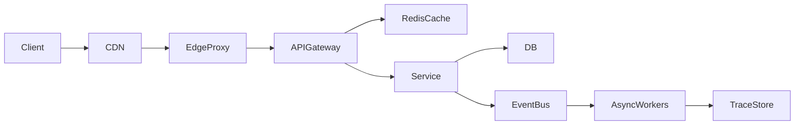
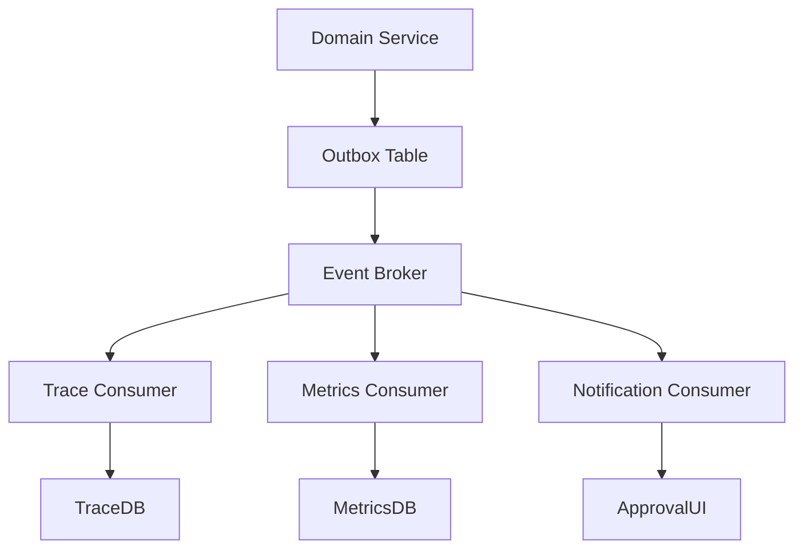

# Scalability, Performance, Cost, and Event-Driven Architecture

## Scalability model
- Horizontal worker scaling by task queue depth.
- Autoscaling based on CPU, queue lag, and p95 latency.
- Partitioned workloads by dataset, tenant, or modality.

## Load balancing model
- L7 balancing for HTTP APIs.
- Queue-based balancing for background runs.
- Weighted routing for canary and A/B evaluation.

## Request path performance model

## Latency, throughput, and caching
- Latency targets by API class (p50/p95/p99).
- Throughput measured as tasks/sec and tool calls/sec.
- Caching layers: CDN, edge cache, application cache, query cache.
- Cache invalidation via event version keys.

## Event-driven architecture
- Event types: `run.started`, `task.completed`, `approval.requested`, `eval.finished`.
- Outbox + broker + idempotent consumer pipeline.
- Dead-letter queues and replay tooling for failed events.

## Performance and security measures
- SLOs: availability, latency, error-rate, durability.
- Security SLOs: auth failure rate, blocked malicious traffic rate, secret leak incidents.
- Capacity planning: max concurrent runs, peak tool call budget, trace ingestion ceiling.

## Cost and performance optimization
- Dynamic model tiering by task complexity.
- Adaptive batching for eval/trace processing.
- Storage lifecycle for artifacts and traces.
- Autoscaling right-sizing and spot/preemptible worker pools.

## Source-informed rationale
- Distributed architecture and latency/caching tradeoffs (Fundamentals of Software Architecture).
- Reliability and operational load balancing practices (Site Reliability Engineering).
- Event and dataflow tradeoffs (DDIA).
