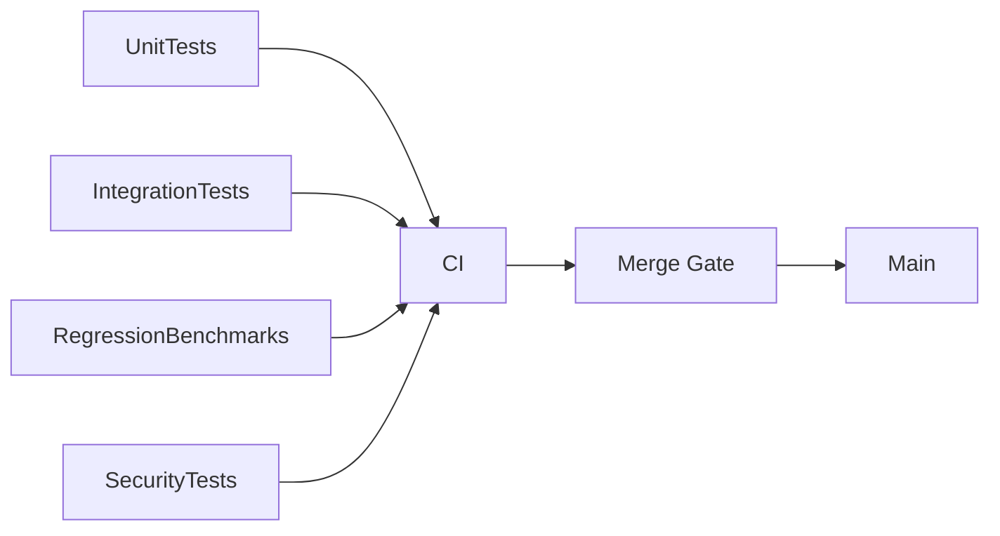

# Testing, Software Quality, Metrics, and SCM

## Testing strategy
- Unit tests: entities, validators, policies, adapters.
- Integration tests: provider contracts, storage contracts, approval flow.
- Regression tests: benchmark score/cost/safety guardrails.
- Reliability tests: timeout, partial failure, queue backpressure, retry storms.

## Test architecture diagram

## Software metrics
- Delivery: lead time, deployment frequency, change failure rate, MTTR.
- Runtime: success rate, p95 latency, throughput, error budget burn.
- Quality: defect escape rate, flaky test rate, mutation score.
- Safety: policy violation frequency, approval bypass attempts, secret redaction misses.

## Software quality controls
- Mandatory code review with checklist.
- Static analysis and formatting hooks.
- Contract tests for public interfaces.
- Trace-linked incident postmortems for production defects.

## Software configuration management
- Trunk-based or short-lived branch model with issue-linked PRs.
- Versioned configs under `configs/` with migration notes.
- Immutable release tags and changelog policy.
- Environment promotion (dev -> staging -> prod) with policy parity.

## Recommended quality gates
- `make precommit`
- `make check`
- benchmark regression delta within threshold
- security scan + dependency vulnerability baseline

## Source-informed rationale
- Testing depth and maintainable quality loops (Art of Unit Testing, Clean Code).
- Architecture fitness and governance metrics (Fundamentals of Software Architecture).
