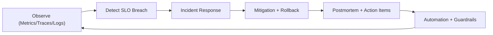

# Software Maintenance, Reliability, Consistency, Availability, and Maintainability

## Reliability model
- Define SLIs/SLOs per capability (run execution, approvals, reporting).
- Use error budgets to prioritize reliability vs feature velocity.
- Decompose incidents by domain ownership and blast radius.

## Consistency and availability strategy
- Strong consistency for safety-critical state.
- High availability for read-heavy dashboards and status APIs.
- Graceful degradation for non-critical analytics under load.

## Maintainability model
- Stable domain interfaces + adapter isolation.
- Incremental refactoring with benchmark parity checks.
- ADR-driven architectural decisions.

## SRE operations loop

## Operational readiness checklist
- Runbooks for critical paths.
- On-call ownership and escalation matrix.
- Chaos drills for dependency and network failures.
- Regular backup/restore verification.

## Source-informed rationale
- Reliability as a primary product requirement (Site Reliability Engineering).
- Distributed failure patterns and recovery decisions (DDIA).
