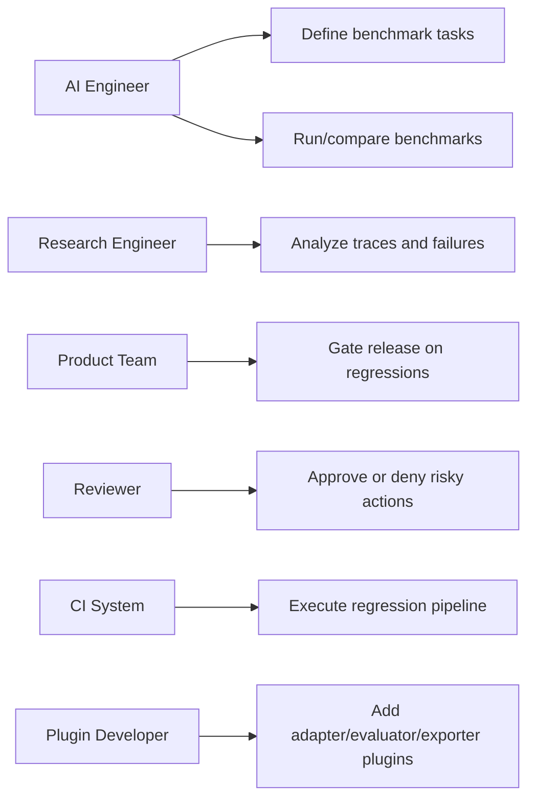
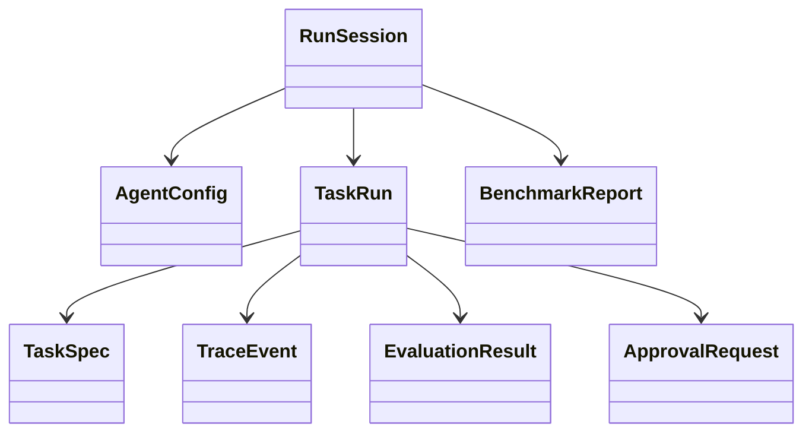
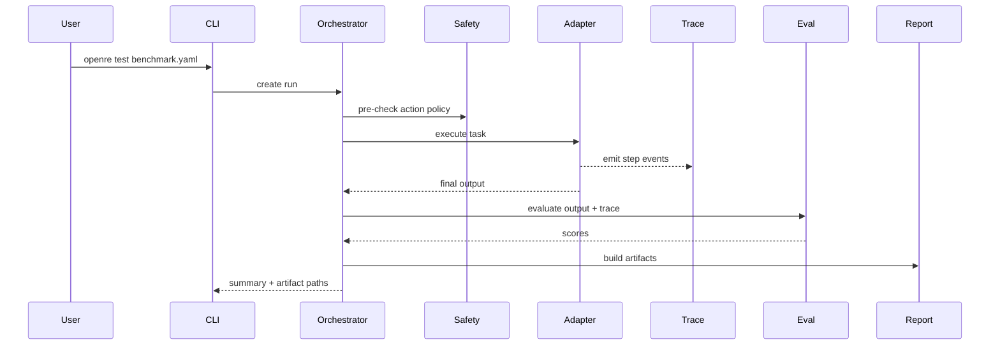
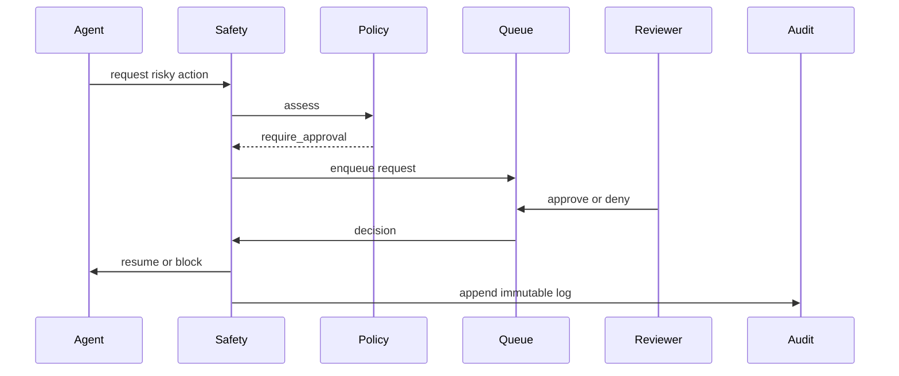

# Design Principles and UML

## Engineering principles
1. Every run is reproducible.
2. Every result is inspectable.
3. Every risky action is auditable.
4. Every benchmark is versioned.
5. Plugin-first extensibility is preserved.

## Required provenance fields
- config fingerprint
- git commit SHA
- dependency snapshot
- model identifier
- prompt version
- evaluator versions

## Patterns by subsystem
- Agent adapters: Adapter, Abstract Factory.
- Evaluators: Strategy, Composite.
- Policies: Chain of Responsibility, rules-engine style.
- Reporting: Builder, Template Method.
- Tracing: Observer, event-sourcing concepts.
- Run lifecycle: State Machine.
- Persistence: Repository + Unit of Work.

## Use case view

## Class view

## Sequence view: benchmark execution

## Sequence view: risky action approval

