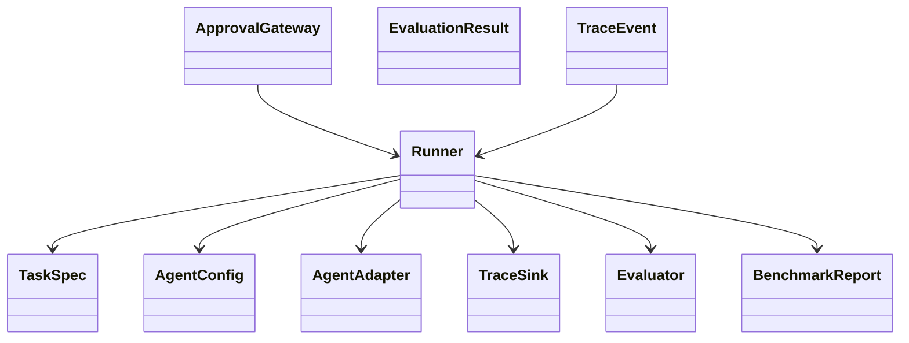
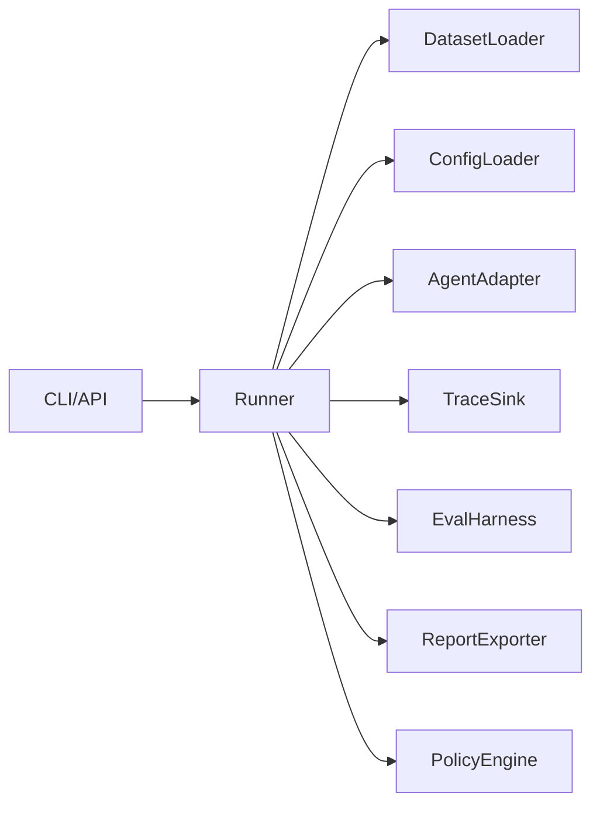
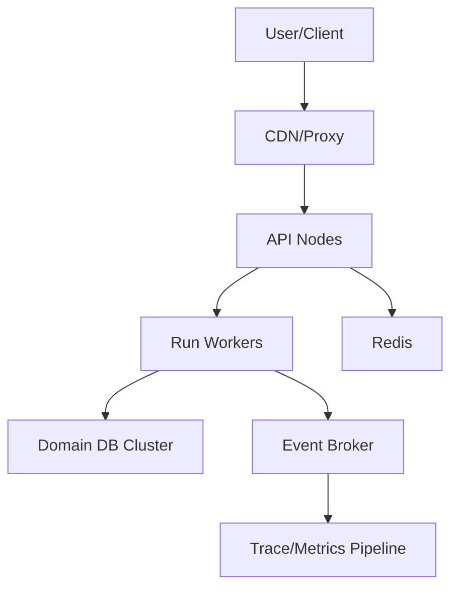

# Design Principles and UML

## Design principles
- Separation of concerns and clear bounded contexts.
- SOLID for core domain abstractions.
- DRY for shared policy and validation logic.
- KISS and YAGNI for runtime-critical paths.
- Explicit dependencies over hidden side effects.

## Design patterns in OpenRe
- Strategy: evaluators, optimizers, retry policies.
- Adapter: OpenAI/Opik/local providers.
- Factory: config-based object construction.
- Observer: trace/event subscribers.
- Chain of Responsibility: safety rule pipeline.
- State Machine: task lifecycle.
- Repository: storage abstraction.

## UML class view

## UML component view

## UML deployment view

