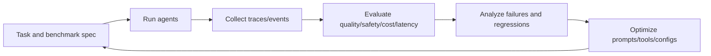

# AI / ML / DL / NLP / Neuroscience / Data Science Strategy

## Scope in OpenRe
OpenRe is not a base-model training platform. It is an AI engineering platform to evaluate and improve agent behavior with reproducible evidence.

## Improvement loop

## Evaluation model

Total score:
- `Score_total = w1*Q + w2*C + w3*L + w4*S + w5*T`

Where:
- `Q` quality
- `C` correctness
- `L` latency efficiency
- `S` safety compliance
- `T` tool-use quality

Regression delta:
- `Delta = Score_current - Score_baseline`

Safety-adjusted score:
- `SafetyAdjustedScore = Score_total - lambda*V`

Confidence-aware judge blending:
- `FinalJudgeScore = alpha*JudgeScore + (1-alpha)*DeterministicScore`

## Data science workstreams
- failure clustering
- drift detection by dataset/config/modality
- evaluator calibration and agreement analysis
- cost/latency frontier analysis
- run lineage and reproducibility diagnostics

## NLP/DL focus areas
- grounded summarization and citation quality
- schema-constrained structured generation
- tool-use trajectory quality
- multimodal reasoning validation

## RL/optimization framing
Objective function:
- `J(theta) = beta1*Q(theta) - beta2*Cost(theta) - beta3*Latency(theta) - beta4*Risk(theta)`

Use both:
- weighted scalar ranking for practical defaults
- Pareto frontier for multi-objective decision support

## Neuroscience-inspired ideas (research track)
- multi-step credit assignment over traces
- working-memory and episodic-memory strategy experiments
- behavior signature clustering for policy adaptation

## Deliverables by maturity stage
- baseline: deterministic evaluators + weighted scoring
- growth: confidence-aware judging + failure clustering
- advanced: active benchmark selection + anomaly detection
