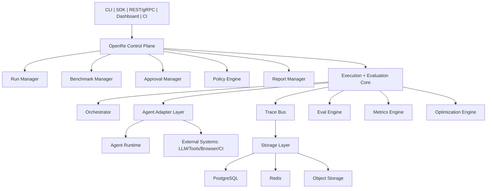
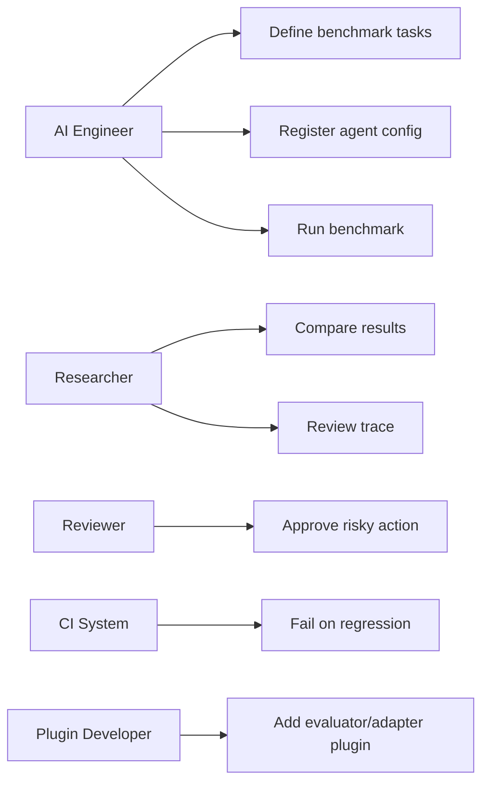
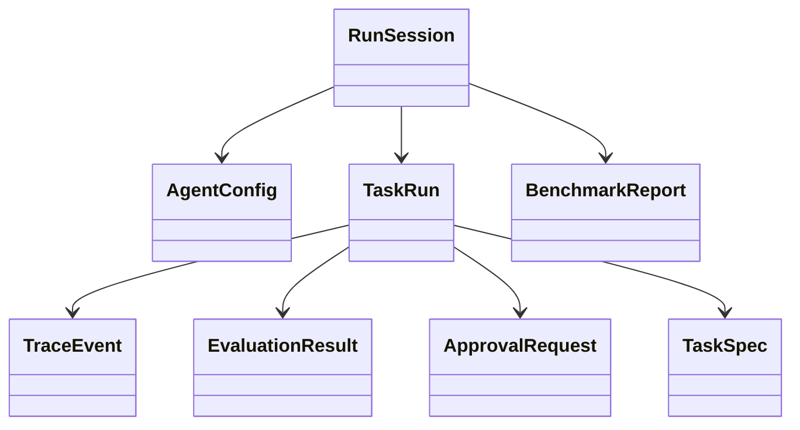
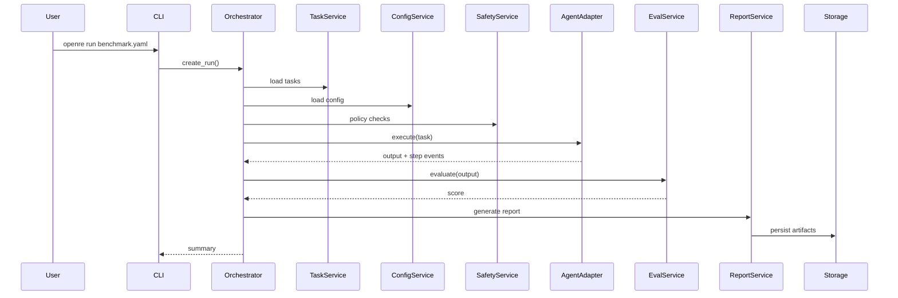
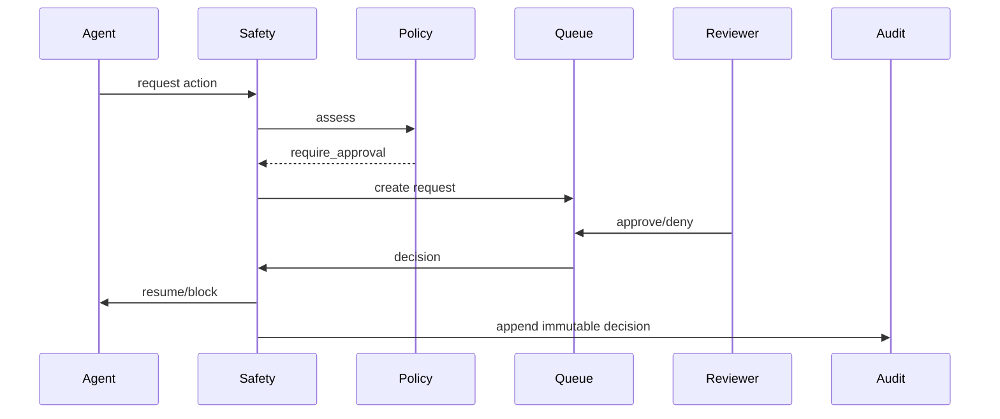

# OpenRe Default Framework Specification

## 1. Vision

OpenRe is the default open-source framework for testing AI agents.

OpenRe is benchmark-first, trace-first, and safety-first. It helps teams test, evaluate, debug, validate, compare, and govern AI agents with software-engineering rigor.

OpenRe should make these questions answerable:
- Does my agent still work after prompt/model/tool changes?
- Which configuration performs best on my benchmark suite?
- Where did it fail, and why?
- What happened step-by-step?
- Can I reproduce and compare runs across versions?
- Can risky actions be approval-gated?
- Can CI block regressions automatically?

OpenRe should feel like:
- pytest for AI agents
- CI/CD quality gates for agent behavior
- observability + evaluation + benchmarking + safety in one system

## 2. Product Positioning

One-line position:
- OpenRe is the default framework for testing AI agents.

Expanded position:
- define agent test suites
- run repeatable benchmark tasks
- trace every step and action
- evaluate outputs automatically
- detect regressions
- compare model/prompt/tool configurations
- enforce safety approvals
- publish benchmark artifacts and dashboards

Adoption thesis:
- Teams currently test agents like demos.
- OpenRe standardizes agent testing as engineering workflow.

## 3. Final Product Surfaces

OpenRe target product interfaces:
- CLI
- Python SDK
- REST API
- optional gRPC API contract
- Web dashboard
- CI integrations
- plugin system

Supported agent classes:
- text agents
- RAG agents
- multimodal agents
- browser/computer-use agents
- tool-using agents
- multi-agent workflows

## 4. Primary User Personas

- AI Engineer: repeatable tests, regressions, traces, config comparisons.
- Research Engineer: benchmark studies, reproducibility, aggregated scoring.
- Product Team: release gates, dashboards, pass/fail snapshots.
- Safety/Compliance Reviewer: approval queues, audit logs, risk evidence.
- Open Source Contributor: modular architecture, local setup, plugin extensibility.

## 5. High-Level Functional Scope

Core modules:
1. Task Specification Engine
2. Agent Adapter Layer
3. Execution Orchestrator
4. Trace Bus/Event Pipeline
5. Evaluation Engine
6. Scoring and Metrics Engine
7. Safety and Approval Engine
8. Benchmark Runner
9. Optimization Engine
10. Reporting and Dashboard
11. CI/CD Integration
12. Plugin and Extension System

## 6. Key Feature Requirements

### 6.1 Agent test definitions
Each test can define:
- prompt/instruction
- context/input artifacts
- expected output/schema
- rubric/evaluator references
- tool constraints
- risk tags
- timeout/cost budgets
- dataset tags
- modality requirements

### 6.2 Controlled execution
Execution controls:
- model variant
- prompt version
- tool set
- memory policy
- retry policy
- deterministic seed where possible
- sandbox constraints

### 6.3 Step tracing
Captured telemetry:
- tool calls and arguments
- tool results
- model outputs
- token usage
- latency
- retries
- safety checks
- approval interactions
- failures

### 6.4 Evaluation
Evaluator families:
- exact match
- semantic similarity
- rubric grading
- model-as-judge
- tool correctness
- workflow completion
- schema validation
- cost/latency efficiency
- safety compliance

### 6.5 Regression testing
Regression checks:
- success rate
- score delta
- cost delta
- latency delta
- tool misuse
- hallucination proxy metrics
- safety violation delta

### 6.6 Benchmarking
Benchmark matrices:
- model x prompt x toolset x architecture x dataset

### 6.7 Human approval
High-risk actions requiring review:
- browser submit
- shell execution
- API write
- file deletion
- financial/prod-impact actions

### 6.8 Reporting
Artifacts and views:
- JSON
- CSV
- HTML
- leaderboard
- run diff
- trace timeline
- CI annotations

## 7. Non-Functional Requirements

- Performance: low orchestrator overhead, streaming events, parallel execution.
- Reliability: idempotent run records, resumable runs, failure isolation.
- Scalability: local -> single-node -> distributed workers.
- Security: RBAC, audit logs, sandboxing, secrets isolation.
- Observability: logs, metrics, traces, lineage, config fingerprints.
- Extensibility: plugin APIs for adapters/evaluators/exporters/tools.

## 8. High-Level Architecture



Architectural style:
- modular layered architecture
- hexagonal boundaries
- event-driven internals with append-only trace events
- materialized views for reporting/leaderboards

## 9. Core Subsystems

### 9.1 Task Specification Subsystem
Responsibilities:
- schema parsing/validation
- rubric and evaluator linkage
- dataset linkage
- risk metadata and versioning

Task fields:
- task_id
- title
- instruction
- inputs
- expected_output
- rubric_id
- tags
- risk_level
- allowed_tools
- max_cost
- max_latency_ms
- modality
- evaluator_config

### 9.2 Agent Adapter Layer
Target adapter examples:
- OpenAI Agents SDK
- LangChain
- CrewAI
- AutoGen
- custom agents
- browser agents

Standard adapter interface:
- initialize(config)
- run(task_context)
- stream_events()
- get_result()
- cancel()
- cleanup()

### 9.3 Orchestrator
Execution phases:
1. task resolution
2. config binding
3. policy checks
4. agent invocation
5. step streaming
6. output capture
7. evaluation
8. scoring
9. reporting
10. archival

### 9.4 Trace Bus
Canonical event types:
- RunStarted
- StepStarted
- ModelCalled
- ToolCalled
- ToolReturned
- PolicyChecked
- ApprovalRequested
- ApprovalGranted
- ApprovalDenied
- StepFailed
- RunCompleted
- EvaluationCompleted

### 9.5 Evaluation Engine
Evaluator categories:
- deterministic
- semantic
- schema
- rubric
- pairwise
- model judge
- safety
- trajectory

### 9.6 Safety and Approval Engine
Risk levels:
- low
- medium
- high
- critical

Policy output decisions:
- allow
- deny
- require_approval
- redact
- sandbox_only

### 9.7 Reporting System
Views:
- summary table
- leaderboard
- per-task drilldown
- run diff
- trace timeline
- cost/latency charts
- regression report
- safety incident log

## 10. Low-Level Design

### 10.1 Main entities
- TaskSpec
- AgentConfig
- RunSession
- TaskRun
- TraceEvent
- EvaluationResult
- ApprovalRequest
- BenchmarkReport

### 10.2 Core services
- TaskService
- AgentConfigService
- OrchestrationService
- EvaluationService
- SafetyService
- ReportService

### 10.3 Data access layer
Repositories:
- TaskRepository
- RunRepository
- TraceRepository
- EvalRepository
- ApprovalRepository
- ReportRepository

Patterns:
- Repository
- Unit of Work

## 11. UML

### 11.1 Use case map


### 11.2 Class view


### 11.3 Sequence: benchmark execution


### 11.4 Sequence: risky action approval


## 12. Deployment and Infrastructure Modes

- Local mode: SQLite/local files/single process.
- Team mode: Postgres + Redis + object storage + worker processes.
- Cloud mode: API tier + worker tier + queue + scalable trace + dashboard.

Suggested backend stack:
- Python core
- FastAPI API
- Pydantic schemas
- orchestration engine (Celery/Dramatiq/Temporal)
- SQLAlchemy
- PostgreSQL
- Redis
- S3-compatible object storage

Suggested frontend stack:
- React/Next.js
- trace timeline UI
- approval queue UI
- benchmark dashboard UI

Observability stack:
- OpenTelemetry
- Prometheus
- Grafana
- structured logs

Execution tooling:
- Playwright
- isolated/sandboxed tool workers

## 13. Architecture Patterns

- Hexagonal architecture
- Event-driven architecture
- Strategy pattern
- Factory pattern
- Repository pattern
- Decorator pattern
- Chain of Responsibility
- CQRS-lite (commands for runs/approvals, queries for report/trace views)

## 14. Core Technical Functions and Formulas

### 14.1 Agent run abstraction
R = Execute(A, T, C, P, E)

Where:
- A: agent implementation
- T: task specification
- C: runtime configuration
- P: policy constraints
- E: execution environment

Output:
R = {O, Tr, M, S}

Where:
- O: final output
- Tr: trace
- M: metrics
- S: status

### 14.2 Total score
Score_total = w1Q + w2C + w3L + w4S + w5T

Where:
- Q: quality
- C: correctness
- L: latency efficiency
- S: safety compliance
- T: tool-use quality

Constraint:
sum(w_i) = 1

Example weights:
- quality: 0.35
- correctness: 0.30
- latency: 0.10
- safety: 0.15
- tool-use: 0.10

### 14.3 Regression delta
Delta = Score_current - Score_baseline

Decision:
- pass if Delta >= -epsilon
- regression if Delta < -epsilon

### 14.4 Cost efficiency
CostEfficiency = 1 - min(1, Cost_run / Cost_budget)

### 14.5 Latency score
LatencyScore = max(0, 1 - Latency_run / Latency_budget)

### 14.6 Pass rate
PassRate = passed_tasks / total_tasks

### 14.7 Safety penalty
SafetyAdjustedScore = Score_total - lambda * V

Where V is safety violation count or severity-weighted violations.

### 14.8 Confidence-weighted evaluation
FinalJudgeScore = alpha * JudgeScore + (1 - alpha) * DeterministicScore

or

WeightedJudge = Confidence * JudgeScore

## 15. Benchmark Pack Model

- Pack A: Research Agent Benchmark
- Pack B: Tool Use Benchmark
- Pack C: Browser Agent Benchmark
- Pack D: Multimodal Benchmark
- Pack E: Enterprise Workflow Benchmark

## 16. Safety Model

Risk formula:
RiskScore = a1I + a2E + a3R + a4D

Where:
- I: impact
- E: externality
- R: reversibility inverse
- D: data sensitivity

Decision bands example:
- 0.00 - 0.25 allow
- 0.25 - 0.50 sandbox
- 0.50 - 0.75 require approval
- 0.75 - 1.00 deny by default

Policy DSL direction:
```text
IF action.type == "browser_submit" AND task.risk_level >= "medium"
THEN require_approval

IF action.type == "filesystem_delete"
THEN deny

IF action.type == "api_write" AND environment == "prod"
THEN require_approval
```

## 17. Data and Storage Strategy

Relational state (PostgreSQL):
- tasks
- configs
- runs
- evaluations
- approvals
- reports metadata

Event data:
- append-only trace events
- optional compaction/materialized read models

Artifacts (object/filesystem):
- screenshots
- HTML reports
- CSV exports
- run JSON
- raw tool outputs

Optional vector store:
- semantic search over traces/tasks if needed

## 18. API Design

Representative resources:
- POST /runs
- GET /runs/{id}
- GET /runs/{id}/trace
- GET /runs/{id}/report
- POST /benchmarks/execute
- POST /approvals/{id}/approve
- POST /approvals/{id}/deny
- GET /leaderboard
- POST /configs/compare

SDK UX target:
```python
from openre import Benchmark, AgentConfig

benchmark = Benchmark.load("benchmarks/research.yaml")
config = AgentConfig.from_file("configs/research_gpt.yaml")

result = benchmark.run(config)
print(result.summary())
```

## 19. CLI Design

Must-have commands:
- openre init
- openre run
- openre test
- openre compare
- openre eval
- openre trace
- openre approve
- openre report
- openre leaderboard

## 20. Dashboard Requirements

- Run overview (status, score, latency, cost, trends)
- Trace viewer (timeline, tool calls, approvals, diffs)
- Benchmark leaderboard (filters and historical trends)
- Approval queue (pending actions, evidence, decisions)
- Regression explorer (baseline vs current, failures, trace links)

## 21. LLD-Oriented Project Structure

```text
openre/
  api/
    routes/
    schemas/
  cli/
    commands/
  core/
    domain/
      models/
      services/
      policies/
    orchestration/
    evaluation/
    tracing/
    reporting/
    optimization/
  adapters/
    agents/
    tools/
    storage/
    evaluators/
    exporters/
  plugins/
  ui/
  tests/
  docs/
benchmarks/
configs/
examples/
```

## 22. Engineering Design Principles

1. Every run is reproducible.
2. Every result is inspectable.
3. Every risky action is auditable.
4. Every benchmark is versioned.
5. Plugin-first extensibility.

Required provenance fields:
- config fingerprint
- git SHA
- dependency snapshot
- model ID
- prompt version
- evaluator versions

## 23. Required Technology and Workstreams

Core engineering:
- domain model
- adapter contracts
- orchestration
- event pipeline
- storage

Product engineering:
- polished CLI
- SDK
- API
- dashboard
- examples/tutorials

Benchmark content:
- benchmark packs
- datasets
- rubrics
- leaderboard-ready tasks

Safety engineering:
- policy engine
- approval queue
- risk model
- evidence snapshots

DevEx:
- one-command install
- one-command quickstart
- Docker
- CI examples
- sample agents

Ecosystem:
- OpenAI adapter
- LangChain adapter
- CrewAI adapter
- AutoGen adapter
- browser adapter

## 24. Advanced "High-Technology" Capabilities

Core advanced capabilities:
- event-sourced run reconstruction
- trace diffing across runs
- evaluator ensembles
- confidence-aware scoring
- approval-based continuation
- matrix comparison across model/prompt/tool variants
- historical trend analysis
- branch-aware regression testing
- execution provenance and lineage
- semantic failure clustering
- root-cause categorization
- run replay

Optional advanced capabilities:
- Bayesian config ranking
- active benchmark selection
- flaky-task detection
- evaluator calibration module
- trace anomaly detection
- behavior-signature clustering

## 25. Design Patterns by Subsystem

- Agent adapters: Adapter + Abstract Factory
- Evaluators: Strategy + Composite
- Policies: Chain of Responsibility + rules-engine style
- Reporting: Builder + Template Method
- Tracing: Observer + event-sourcing concepts
- Run execution: State Machine

## 26. State Machines

Run states:
- CREATED
- QUEUED
- RUNNING
- WAITING_APPROVAL
- EVALUATING
- COMPLETED
- FAILED
- CANCELED

Approval states:
- PENDING
- APPROVED
- DENIED
- EXPIRED
- CANCELED

## 27. Optimization Engine

Inputs:
- benchmark suite
- parameter search space
- model candidates
- prompt variants
- tool policies

Outputs:
- best config by weighted objective
- Pareto frontier
- ranking report

Objective:
J(theta) = beta1Q(theta) - beta2Cost(theta) - beta3Latency(theta) - beta4Risk(theta)

## 28. OpenRe Self-Testing Strategy

- Unit tests: parser/policy/evaluator/scoring/repository.
- Integration tests: run lifecycle/trace/approval/report generation.
- Contract tests: adapter and plugin compatibility.
- End-to-end tests: CLI to report, dashboard approval flow.
- Golden tests: snapshot benchmark/report stability.

## 29. Documentation Set Required

- Vision and manifesto
- Quickstart
- Architecture overview
- Benchmark authoring guide
- Adapter authoring guide
- Evaluator authoring guide
- Safety policy guide
- Trace model guide
- CI integration guide
- Dashboard walkthrough
- API reference
- FAQ
- alternatives comparison

## 30. 10k-Star Product Story

OpenRe should present itself as:
- the standard way to test AI agents before shipping

Public workflow story:
- write agent tests
- run in CI
- inspect trace-linked failures
- compare versions
- gate dangerous actions
- publish benchmark evidence

## 31. Codex-Ready Build Prompt

Build OpenRe as the default framework for testing AI agents, combining benchmark execution, trace collection, evaluation, regression detection, safety approvals, and reporting.

Product goals:
- make agent testing repeatable, inspectable, and production-ready
- support text/tool/browser/multimodal agents
- provide CLI/SDK/API/dashboard
- enforce benchmark-first, trace-first, safety-first workflow
- enable CI quality gates

Success criteria:
- install and run benchmark in under five minutes
- every run emits trace, score, and report artifacts
- regressions fail CI
- risky actions are blocked or approval-gated
- results are reproducible and inspectable
- repository is polished and open-source ready
